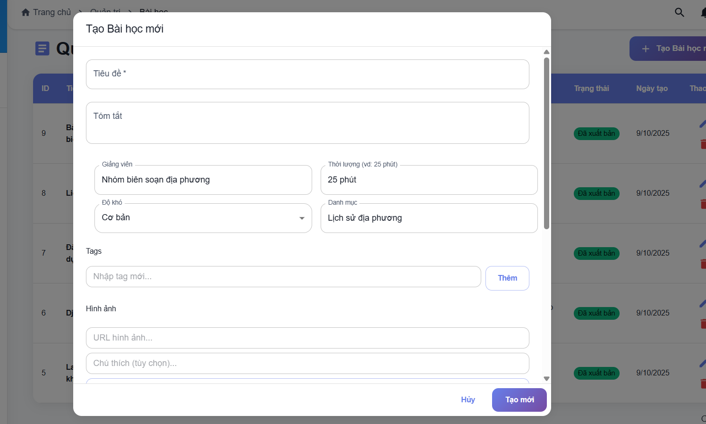

# 📚 HƯỚNG DẪN SỬ DỤNG HỆ THỐNG GIẢNG DẠY LỊCH SỬ LÂM ĐỒNG

## 🚀 KHỞI ĐỘNG HỆ THỐNG

### 1. Khởi động Database (Docker)

```powershell
docker-compose up -d
```

### 2. Khởi động Backend

```powershell
cd backend
npm start
```

Backend sẽ chạy tại: **http://localhost:4000**

### 3. Khởi động Frontend

```powershell
cd frontend
npm run dev
```

Frontend sẽ chạy tại: **http://localhost:5173**

---

## 👥 TÀI KHOẢN DEMO

### Admin (Quản trị viên)

- **Email:** admin@lamdong.edu.vn
- **Mật khẩu:** demo123
- **Quyền:**
  - Quản lý tất cả bài học
  - Quản lý tất cả quiz
  - Xem thống kê hệ thống

### Teacher (Giáo viên)

- **Email:** teacher@lamdong.edu.vn
- **Mật khẩu:** demo123
- **Quyền:**
  - Tạo và quản lý bài học của mình
  - Tạo và quản lý quiz của mình
  - Xem danh sách học sinh

### Student (Học sinh)

- **Email:** student@lamdong.edu.vn
- **Mật khẩu:** demo123
- **Quyền:**
  - Xem và học các bài học
  - Làm bài kiểm tra
  - Xem điểm và kết quả

---

## 📖 HƯỚNG DẪN THEO ROLE

### 🔴 ADMIN - Quản trị viên

#### 1. Đăng nhập

1. Mở http://localhost:5173
2. Nhấn vào ô **"Quản trị Hệ thống"** hoặc nhập:
   - Email: admin@lamdong.edu.vn
   - Mật khẩu: demo123

#### 2. Quản lý Bài học

1. Sau khi đăng nhập, vào menu bên trái
2. Chọn **"Admin: Quản lý Bài học"**
3. Bạn sẽ thấy:
   - **Danh sách tất cả bài học** (của tất cả giáo viên)
   - Nút **"Tạo Bài học mới"**

##### Tạo bài học mới:

1. Nhấn nút **"Tạo Bài học mới"**
2. Điền thông tin:
   - **Tiêu đề:** Tên bài học
   - **Tóm tắt:** Mô tả ngắn gọn
   - **Nội dung:** Sử dụng trình soạn thảo Rich Text (có định dạng, hình ảnh, v.v.)
   - **Published:** Bật/tắt để xuất bản bài học
3. Nhấn **"Tạo"**

##### Sửa bài học:

1. Trong danh sách, nhấn nút **Edit** (biểu tượng bút)
2. Chỉnh sửa thông tin
3. Nhấn **"Cập nhật"**

##### Xóa bài học:

1. Nhấn nút **Delete** (biểu tượng thùng rác)
2. Xác nhận xóa

#### 3. Quản lý Quiz

1. Vào menu **"Admin: Quản lý Quiz"**
2. Bạn sẽ thấy danh sách tất cả quiz

##### Tạo quiz mới:

1. Nhấn **"Tạo Quiz mới"**
2. Điền thông tin:
   - **Tiêu đề:** Tên quiz
   - **Mô tả:** Giới thiệu về quiz
   - **Liên kết bài học (tùy chọn):** Chọn bài học nếu muốn quiz gắn với bài học cụ thể
3. **Thêm câu hỏi:**
   - Nhấn **"Thêm câu hỏi"**
   - Nhập nội dung câu hỏi
   - Nhập điểm cho câu hỏi
   - **Thêm đáp án:** Nhấn **"Thêm đáp án"**
   - Nhập nội dung đáp án
   - **Đánh dấu đáp án đúng:** Nhấn vào radio button bên cạnh đáp án đúng
   - Mỗi câu hỏi phải có ít nhất 2 đáp án và 1 đáp án đúng
4. Nhấn **"Tạo Quiz"**

##### Sửa quiz:

1. Nhấn nút **Edit**
2. Chỉnh sửa câu hỏi, đáp án
3. Nhấn **"Cập nhật"**

##### Xóa quiz:

1. Nhấn nút **Delete**
2. Xác nhận xóa

---

### 🟢 TEACHER - Giáo viên

#### 1. Đăng nhập

1. Mở http://localhost:5173
2. Nhấn vào ô **"GV. Trần Thị Giáo"** hoặc nhập:
   - Email: teacher@lamdong.edu.vn
   - Mật khẩu: demo123

#### 2. Quản lý Bài học của tôi

1. Vào menu **"GV: Quản lý Bài học"**
2. Bạn sẽ chỉ thấy **bài học do bạn tạo**
3. Các chức năng giống Admin:
   - Tạo bài học mới
   - Sửa bài học của mình
   - Xóa bài học của mình

#### 3. Quản lý Quiz của tôi

1. Vào menu **"GV: Quản lý Quiz"**
2. Bạn sẽ chỉ thấy **quiz do bạn tạo**
3. Các chức năng giống Admin:
   - Tạo quiz mới
   - Sửa quiz của mình
   - Xóa quiz của mình

**Lưu ý:** Teacher chỉ có thể quản lý nội dung của chính mình, không thể xem/sửa/xóa của giáo viên khác.

---

### 🔵 STUDENT - Học sinh

#### 1. Đăng nhập

1. Mở http://localhost:5173
2. Nhấn vào ô **"HS. Nguyễn Văn Học"** hoặc nhập:
   - Email: student@lamdong.edu.vn
   - Mật khẩu: demo123

#### 2. Xem bài học

1. Vào menu **"Bài học"**
2. Danh sách tất cả bài học đã xuất bản
3. Nhấn vào bài học để xem chi tiết
4. Đọc nội dung, xem hình ảnh, video

#### 3. Làm bài kiểm tra

1. Vào menu **"Bài kiểm tra"**
2. Chọn quiz muốn làm
3. Trả lời các câu hỏi
4. Nhấn **"Nộp bài"**
5. Xem kết quả và điểm số

#### 4. Xem Dashboard

1. Vào **"Dashboard"**
2. Xem:
   - Tiến độ học tập
   - Điểm số các bài kiểm tra
   - Bài học đã hoàn thành

---

## 🔧 TÍNH NĂNG CHI TIẾT

### Rich Text Editor (Trình soạn thảo)

Khi tạo/sửa bài học, bạn có thể:

- **Định dạng văn bản:** Bold, Italic, Underline
- **Tiêu đề:** H1, H2, H3, H4, H5, H6
- **Danh sách:** Bullet list, Numbered list
- **Chèn link**
- **Chèn hình ảnh**
- **Căn chỉnh:** Left, Center, Right
- **Màu chữ**

### Quiz System

- **Quiz độc lập:** Không cần liên kết với bài học
- **Quiz theo bài học:** Gắn với bài học cụ thể
- **Nhiều câu hỏi:** Không giới hạn số câu hỏi
- **Nhiều đáp án:** Mỗi câu tối thiểu 2 đáp án
- **Điểm số:** Mỗi câu hỏi có điểm riêng
- **Tự động chấm:** Hệ thống tự chấm và hiển thị kết quả

### Phân quyền

- **Admin:** Toàn quyền quản lý
- **Teacher:** Chỉ quản lý nội dung của mình
- **Student:** Chỉ xem và làm bài

---

## 📊 API ENDPOINTS

### Lessons (Bài học)

- `GET /api/lessons` - Danh sách bài học
- `GET /api/lessons/:id` - Chi tiết bài học
- `GET /api/lessons/slug/:slug` - Bài học theo slug
- `POST /api/lessons` - Tạo bài học mới (Admin/Teacher)
- `PUT /api/lessons/:id` - Cập nhật bài học (Admin/Teacher)
- `DELETE /api/lessons/:id` - Xóa bài học (Admin/Teacher)

### Quizzes (Bài kiểm tra)

- `GET /api/quizzes/manage/list` - Danh sách quiz (Admin/Teacher)
- `GET /api/quizzes/manage/:id` - Chi tiết quiz để sửa
- `POST /api/quizzes/manage` - Tạo quiz mới (Admin/Teacher)
- `PUT /api/quizzes/manage/:id` - Cập nhật quiz (Admin/Teacher)
- `DELETE /api/quizzes/manage/:id` - Xóa quiz (Admin/Teacher)
- `GET /api/quizzes/:lessonId` - Lấy quiz cho học sinh
- `POST /api/quizzes/:lessonId/submit` - Nộp bài (Student)

### Auth (Xác thực)

- `POST /api/auth/register` - Đăng ký
- `POST /api/auth/login` - Đăng nhập
- `POST /api/auth/refresh` - Làm mới token

---

## 🐛 XỬ LÝ LỖI THƯỜNG GẶP

### 1. Backend không khởi động

```powershell
# Kiểm tra port 4000 có bị chiếm không
netstat -ano | findstr :4000

# Kill process nếu cần
taskkill /F /PID <PID>
```

### 2. Frontend không kết nối Backend

- Kiểm tra Backend đang chạy tại http://localhost:4000
- Kiểm tra file `.env` trong frontend có đúng `VITE_API_BASE_URL=http://localhost:4000/api`

### 3. Database không kết nối

```powershell
# Kiểm tra Docker container
docker ps

# Nếu không chạy, khởi động lại
docker-compose up -d

# Xem logs
docker-compose logs -f postgres
```

### 4. Không thấy menu "Quản lý Bài học" hoặc "Quản lý Quiz"

- Đảm bảo đã đăng nhập với tài khoản Admin hoặc Teacher
- Xóa cache browser (Ctrl + Shift + Delete)
- Đăng xuất và đăng nhập lại

### 5. Lỗi "Invalid credentials" khi đăng nhập

- Kiểm tra lại email và mật khẩu
- Đảm bảo database đã được seed với demo users
- Chạy lại script seed nếu cần:
  ```powershell
  cd backend/scripts
  node recreateDemoUsers.js
  ```

---

## 📞 HỖ TRỢ

Nếu gặp vấn đề, kiểm tra:

1. **Backend logs:** Xem terminal đang chạy backend
2. **Frontend console:** F12 trong browser → Console tab
3. **Database:** Vào pgAdmin hoặc dùng `docker exec` để kiểm tra

---

## ✅ CHECKLIST TRƯỚC KHI SỬ DỤNG

- [ ] Docker đang chạy
- [ ] PostgreSQL container đang chạy (docker ps)
- [ ] Backend đang chạy tại port 4000
- [ ] Frontend đang chạy tại port 5173
- [ ] Database đã được seed với demo users
- [ ] Đã đăng nhập với đúng tài khoản role

---

**Chúc bạn sử dụng hệ thống hiệu quả! 🎉**
